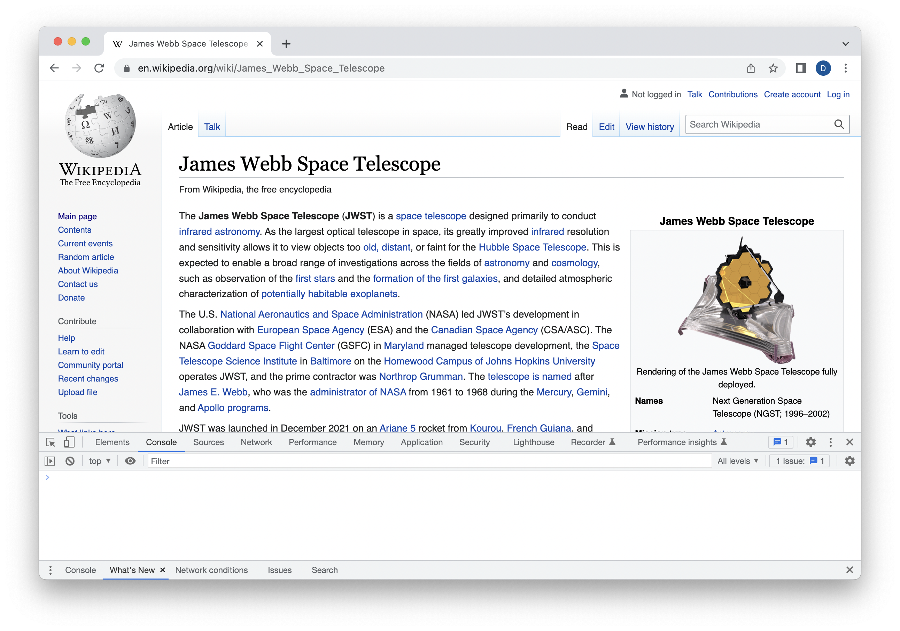
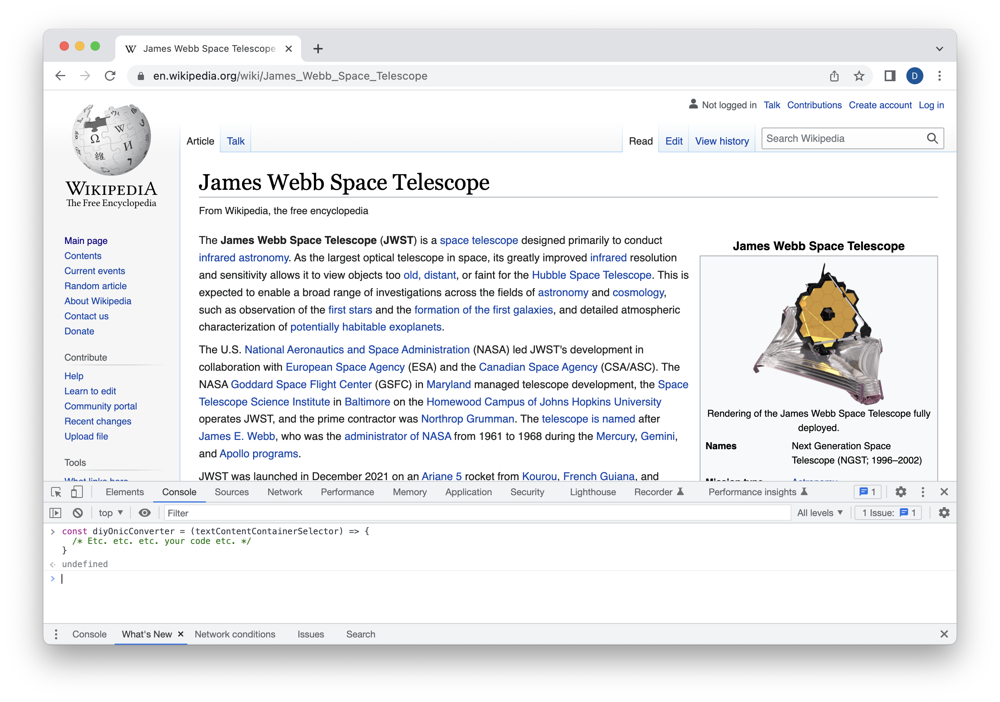
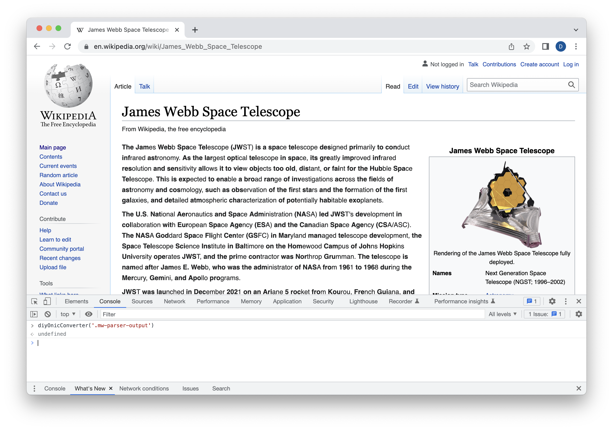

# DIY [Bionic Reading Converter](https://bionic-reading.com) Coding Challenge

_Read this whole document before starting the exercise._

## Introduction
The following challenge seeks to highlight your knowledge of the following:
* JavaScript (particularly ES6 or later)
* HTML/CSS
* DOM manipulation
* CSS selectors
* String processing
* Array iteration
* Identification of edge and corner cases

## Setup
1. Fork this repo https://github.com/friendbuy/diy-onic-converter
2. Clone the repository locally on your computer
3. Install dependencies by invoking `yarn` or `npm install`
4. Start the local web server via `yarn start` or `npm start`
5. Implement the requested function in _/public/diy-onic-converter.js_ (see below)
6. Test your function by calling it from the console of the test web page (see below)
7. Commit as frequently as needed and push your code accordingly
8. Edit _README.md_ to describe your implementation (see below)
9. If your implementation is sufficiently robust and generalized such that it can be copy-pasted into another web page’s console and invoked from there (see below), please indicate this so that we can try it out

## Tasks

### 1. Learn about “bionic reading”
Visit https://bionic-reading.com and read about what it is. They have a simple online converter that shows you how they transform text into this “bionic” form. Please note, we are asking you to do this solely as an exercise for you to demonstrate your skills, and _not_ to produce a competitor for their core idea and company. We are just using it as a basis for a front-end coding challenge.

### 2. Implement your own converter function
Write a function that will accept a CSS selector string as an argument. The function should then convert the content of every `p` element within the elements matched by that selector so that every word is formatted in a style that is similar to bionic reading.

* The function should be written so that its code can be copy-pasted into a web browser’s developer tools console
* Once defined in the console, the function should then be called with a selector from the current web page
* When it finishes execution, the `p` elements within the selected element in the web page should now be formatted similarly to bionic reading
* The function must process the HTML content _locally_—no calling of APIs that do the conversion remotely

Note that we aren’t giving an exact definition of how bionic reading format is determined. A reasonable facsimile will do, even if it does not match the official [bionic reading conversion](https://api.bionic-reading.com/convert/) exactly. Still, the closer the better!

If you are able to work quickly enough, feel free to give your code additional features. For example, you code might be able to install an _in-page_ user interface for toggling between original and bionic reading format. Or your function might take an options argument which can customize the way formatting is performed.

### 3. Document your work
Edit _README.md_ so that it describes your function. State what it does, how it does it, and provide instructions on how to use it—the more turnkey, the better!

Take particular note of edge, corner, or unhandled cases in your function—considering the time frame, it’s very likely that your program will have these! We feel it’s just as important for a software developer to know the limitations of their code as well as its capabilities. This shows that you understand the programming need deeply and have a sense of the huge number of variations that a web page can have.

## Example
Visit a website that has paragraphs to convert and open its developer tools console:

Copy-paste your code to the console:

Invoke your function with a selector containing the paragraphs to convert:

Example intentionally shows some limitations:
* Boldface text is not preserved
* Links are lost

These would be documented in _README.md_.

## Criteria

### Bionic
* The function works as specified (copy-paste into console, invoke function with selector, see results on the current website)
* The converted HTML and styles sufficiently resemble the conversion performed by https://bionic-reading.com
* _README.md_ provides accurate instructions on how to execute the function

### Super Bionic
* _README.md_ describes the limitations of this implementation (provide sample websites that demonstrate these limitations, if possible)
* The function includes one capability that goes beyond the basic bionic reading conversion described here

### Ultra Bionic Max
* The function is very robust and handles a wide variety of HTML content
* The function includes multiple capabilities that go beyond the basic bionic reading conversion described here
* Big flex: an in-page user interface that allows the user to convert/toggle the page interactively

